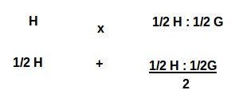
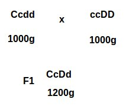
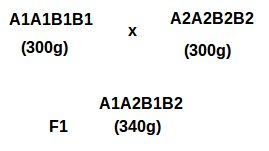
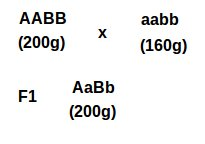

<!-- Limit image width and height -->

<!-- Center image on slide -->

## Exogamia ou Cruzamento

- É o acasalamento entre indivíduos não parentes (raças diferentes) ou não semelhantes fenotipicamente. 
- Visa promover a heterozigose, contrário a endogamia.
- Cruzamento não é hibridização.

---

## Exogamia ou Cruzamento

-O cruzamento entre raças gera animal mestiço ou cruzado, este animal carreia gene de cada raça.
- O **grau de sangue** refere-se a proporção de cada raça que deu origem ao animal mestiço.

---

## Exemplo

- Cruzando um animal da raça Holandês (H), com um da raça Gir (G), o produto será 1/2 H : 1/2 G.

- Caso o cruzamento continue com outro animal Holandês teremos:

---

## Exemplo

- O produto do acasalamento irá gerar: 1/2 H + 1/4 H : 1/4 G
- Geração F2 será **3/4 H : 1/4 G**

---

## Heterose

- Heterose é a expressão fenotípica mais intensa do cruzamento (mestiço) em relação a média dos progenitores.
- Pode ser enominado também como vigor híbrido.
- É considerada heterose também se o mestiço for superior a uma das raças paternas.

---

## Causas de Heterose

- Heterose (vigor híbrido) origina-se principalemente devido a heterozigose envolvendo ação gênica não aditiva.

---

## Causas de Heterose - Dominância

- O vigor híbrido observado nos mestiços é resultado da restauração de genes dominantes em locos das linhagens parentais, onde os recessivos passaram a ser homozigóticos e que nos mestiços passaram a ser heterozigotos.

---

## Causas de Heterose - Sobredominância

- Heterozigotos são superiores aos homozigotos.

---

## Causas de Heterose - Epistasia

- Interação de pares de genes não alélicos.
- Ex: A e B juntos produzem 200g de peso; A ou B isolados produzem 160g de peso.

---

## Causas de Heterose

- Efeitos não aditivos não produzem heterose. Sendo assim, o mestiço não produz média do valor fenotípico superior aos pais.

---

## Estimativa da Heterose

- A estimativa da heterose (H) é dado pela fórmula:

$H$ = ($M_F$$_1$ - $M_P$ / $M_P$) * $100$

- O resultado é quantos porcento superior que os mestiçôs são em comparação a média dos progenitores.

---

## Permanência da heterose

- Consideramos a heterose na geração F1 como heterose total. 
- Se os acasalamentos são ao acaso espera-se que a heterose na geração F2 seja 50% inferior ao da geração F1.
- É esperado que os valores da heterose na geração F3, F4, F5... se estabilizem próximo ao da geração F2.

---

## Seleção

- O efeito primário da seleção visa aumentar a frequência gênica favorável, consequentemente, reduzindo a frequência gênica desfavorável.

- O processo de seleção artificial pode comprometer o valor adaptativo dos indivíduos.

- Durante o processo de seleção é preciso considerar o ambiente com a potencialidade genética.

---

## Consideração Gerais Sobre Seleção

- Seleção é um processo de melhoramento genético, mas não é sistema de acasalamento.
- A seleção não cria novos genes, somente altera a frequência dos mesmos na população.
- As mudanças genéticas obtidas pela seleção são permanentes, a menos que se faça uma seleção em sentido contrário.

---

## Consideração Gerais Sobre Seleção

- A seleção é mais eficiente quando as frequências dos genes é próxima a 0,5. O processo é de baixa eficiência quando as frequências forem próximas a 0 ou 1.
- A seleção não fixa o Heterozigoto.

---

## Consideração Gerais Sobre Seleção

- São necessárias muitas gerações para tornar abundante um gene que é raro na população.
- A seleção exerce pequeno efeito sobre o aumento da homozigose.
